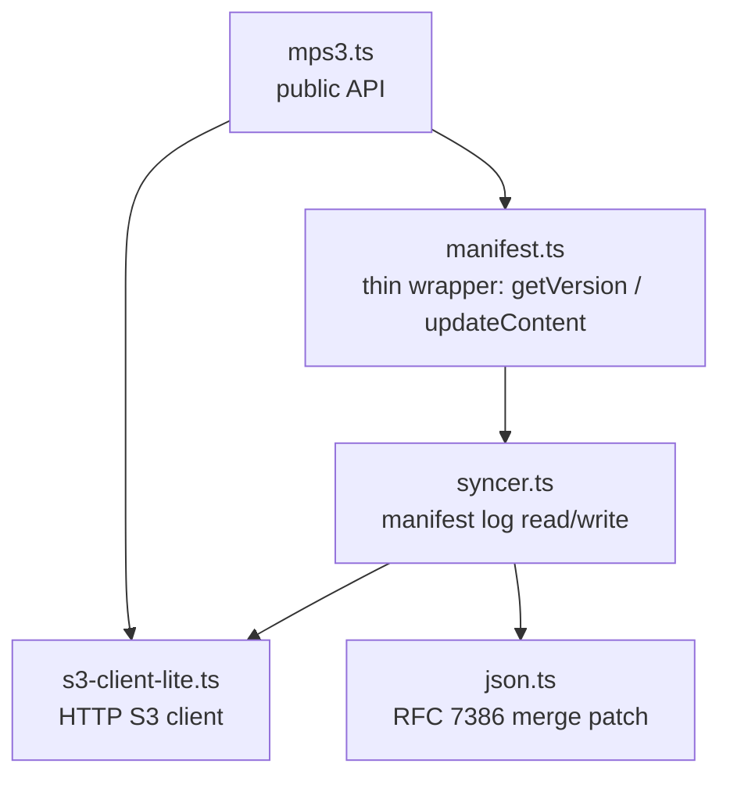

# Architecture

A top-down map of MPS3 for someone who has never opened the codebase.

## One-paragraph summary

A client writes by uploading content to S3, then appending a JSON Merge
Patch to a time-ordered manifest log (also stored in S3, one object per
write, sorted by a base-32 timestamp suffix). Reads explicitly fetch the
latest manifest state on demand, replay patches in order, and resolve a
causally consistent view of the key→version map. Realtime change
notifications are deferred to a Phase 10 opt-in `NotificationBus`
(separate package, not yet shipped). The protocol is specified in
[sync_protocol.md](sync_protocol.md) and proven causally consistent in
[causal_consistency_checking.md](causal_consistency_checking.md).

## Module dependency graph

## Lifecycle of a `put()`

`mps3.put(ref, value)` resolves to a Promise that settles when the write is
durable on S3.

1. **`mps3.put` → `mps3.putAll`** (`src/mps3.ts`): wraps the single ref in
   a `Map`, resolves default bucket/manifest, calls `_putAll`.
2. **`_putAll`** (`src/mps3.ts`): for each ref it kicks off a content
   upload via `_putObject` (PUT to S3 at `key@<version>` if `useVersioning`
   is off, else just `key`). The set of `(ref → contentVersion)` results
   is exposed as a Promise.
3. **`manifest.updateContent` → `syncer.updateContent`** (`src/syncer.ts`):
   - Generates a monotonic manifest-key suffix:
     `<base32-timestamp>_<sessionId>_<seq>`. The timestamp is clamped to
     `latest_timestamp + 1` so writes are ordered even when clocks jitter.
   - Awaits the content upload, then PUTs the manifest patch to
     `<manifestKey>@<suffix>`. The patch is a JSON Merge Patch over the
     prior manifest state. (Manifest-first ordering: content body lands
     before the manifest entry that references it.)
   - Validates the server's response timestamp; if outside `LAG_WINDOW_MILLIS`
     of expected, adapts `clockOffset` and retries with a new suffix.
   - Optionally PUTs a sentinel `<manifestKey>` (no `@suffix`) so future
     readers can short-circuit with a 304 (`If-None-Match`).

## Reads and change notifications

The kernel is read-on-demand: `mps3.get(ref)` calls
`manifest.getVersion(ref)`, which resolves the latest state from the
manifest log via `syncer.getLatest()` and then fetches the referenced
content. There is no background poller and no push channel inside the
kernel. Realtime change notifications are deferred to a Phase 10 opt-in
`NotificationBus` package; callers that need change events today drive
their own polling by re-calling `mps3.get(ref)`.

## Where invariants live

- **Causal consistency**: `syncer.ts` — replay is strictly oldest-to-newest;
  a reader's observed sequence is a prefix of the global manifest log.
  Proof: [causal_consistency_checking.md](causal_consistency_checking.md).
- **Optimistic concurrency / clock skew**: `Syncer.isValid` and the retry
  loop in `updateContent`. A write whose server-side timestamp falls
  outside `LAG_WINDOW_MILLIS` is retried with an adjusted `clockOffset`.
- **JSON Merge Patch semantics**: `json.ts` — RFC 7386 with the
  array-replacement convention; see [JSON_merge_patch.md](JSON_merge_patch.md).

## Key types (where the contracts live)

- `Ref` / `ResolvedRef` (`packages/protocol/src/types.ts`): `{ bucket?, key }` and resolved
  variant. The string form `"key"` is implicitly `{ key: "key" }`.
- `Branded<T, B>` (`packages/protocol/src/types.ts`): nominal-type pattern. `UUID` and
  `VersionId` are both `string`s but not assignable to each other.
- `ManifestFile` (`src/syncer.ts`): the object PUT to each manifest key.
  Contains `files: { [url]: FileState }` and an `update` (the merge patch).
- `FileState` (`src/syncer.ts`): `{ version, replication }` per content ref.
- `MPS3Config` / `ResolvedMPS3Config` (`src/mps3.ts`): user-facing and
  internal config. `Resolved*` is what the runtime sees (defaults filled in).

## Storage layout in S3

For a manifest at `bucket/path/manifest.json`, the bucket contains:

- `path/manifest.json` — sentinel for fast polling (only its ETag matters).
- `path/manifest.json@<base32-time>_<session>_<seq>` — one object per write,
  with the JSON Merge Patch as its body.
- `path/<contentKey>` (versioned bucket) or `path/<contentKey>@<uuid>`
  (unversioned) — actual content.

Listing `Prefix: path/manifest.json@` in descending order yields the most
recent writes first. The `LAG_WINDOW_MILLIS` guard filters out entries with
clock skew beyond the protocol's tolerance.
