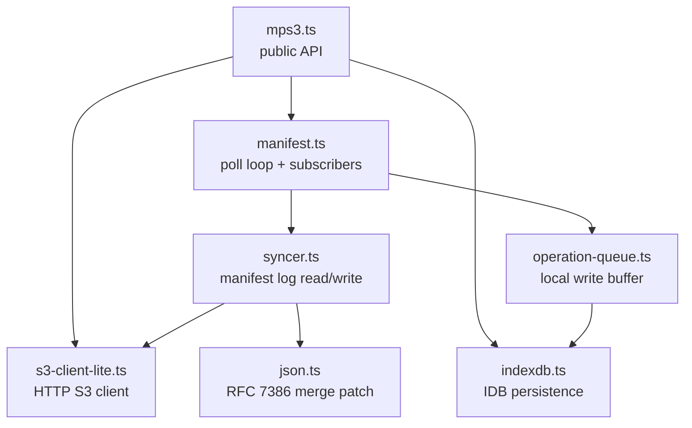

# Architecture

A top-down map of MPS3 for someone who has never opened the codebase.

## One-paragraph summary

A client writes by uploading content to S3, then appending a JSON Merge
Patch to a time-ordered manifest log (also stored in S3, one object per
write, sorted by a base-32 timestamp suffix). Other clients poll the log,
replay patches in order, and observe a causally consistent view of the
key→version map. Local writes are buffered in IndexedDB and acknowledged
optimistically, giving the client an offline-first feel. The protocol is
specified in [sync_protocol.md](sync_protocol.md) and proven causally
consistent in [causal_consistency_checking.md](causal_consistency_checking.md).

## Module dependency graph

## Lifecycle of a `put()`

`mps3.put(ref, value)` resolves to a Promise that settles when the write is
durable (locally or remotely, depending on `await`).

1. **`mps3.put` → `mps3.putAll`** (`src/mps3.ts`): wraps the single ref in
   a `Map`, resolves default bucket/manifest, calls `_putAll`.
2. **`_putAll`** (`src/mps3.ts`): for each ref it kicks off a content
   upload via `_putObject` (PUT to S3 at `key@<version>` if `useVersioning`
   is off, else just `key`). The set of `(ref → contentVersion)` results
   is exposed as a Promise.
3. **`manifest.updateContent` → `syncer.updateContent`** (`src/syncer.ts`):
   - Generates a monotonic manifest-key suffix:
     `<base32-timestamp>_<sessionId>_<seq>`. The timestamp is clamped to
     `latest_timestamp + 1` so writes are ordered even when clocks jitter.
   - Calls `operationQueue.propose(...)` — the write is persisted to
     IndexedDB so a refresh-mid-write doesn't lose it.
   - If `await: "local"`, returns now (offline-first ack).
   - Otherwise, awaits the content upload, then PUTs the manifest patch to
     `<manifestKey>@<suffix>`. The patch is a JSON Merge Patch over the
     prior manifest state.
   - Validates the server's response timestamp; if outside `LAG_WINDOW_MILLIS`
     of expected, adapts `clockOffset` and retries with a new suffix.
   - Optionally PUTs a sentinel `<manifestKey>` (no `@suffix`) so other
     clients can short-circuit polling with a 304 (`If-None-Match`).
4. **`manifest.poll()`** is invoked locally to immediately notify own
   subscribers about the new state.

## Lifecycle of a `subscribe()`

`mps3.subscribe(key, handler)` returns an `unsubscribe` function. The handler
is called with the initial value, then on every change, then once with
`undefined` if the key is deleted.

1. **`mps3.subscribe`** (`src/mps3.ts`): resolves manifest + key refs,
   calls `manifest.subscribe`, fires an immediate `mps3.get` for the
   initial value.
2. **`manifest.subscribe`** (`src/manifest.ts`): adds a `Subscriber` record
   (ref + handler + lastVersion) to the manifest's subscriber set. Returns
   the unsubscribe closure.
3. **Polling** is started by `manifest.poll()`: when `subscriberCount > 0`,
   a `setInterval` at `config.pollFrequency` (default `1000ms`) calls `poll`.
4. **Each poll** (`manifest.poll`):
   - Calls `syncer.getLatest()` which:
     - Lists manifest objects with prefix `<manifestKey>@` from S3.
     - Discards keys whose embedded timestamp is more than
       `LAG_WINDOW_MILLIS` from the S3 `LastModified` header (clock-skew
       guard); GCs them if `autoclean` is on.
     - Replays patches **oldest-first** up to a high-water mark, merging
       each into the local state.
   - Builds a `mask` from `operationQueue.flatten()` — the local optimistic
     writes that haven't been confirmed by a manifest replay yet.
     `flatten()` returns `OMap<Ref, [value, sequence]>` tuples; the `value`
     is what the local state would resolve to right now, the `sequence` is
     a monotonic operation number.
   - For each subscriber:
     - If the ref is in `mask`, notify with the local value (version
       `local-<seq>`).
     - Otherwise, look up the ref in the latest manifest's `files` map; if
       present and version differs from `lastVersion`, fetch the content
       and notify.

## Where invariants live

- **Causal consistency**: `syncer.ts` — replay is strictly oldest-to-newest;
  a subscriber's observed sequence is a prefix of the global manifest log.
  Proof: [causal_consistency_checking.md](causal_consistency_checking.md).
- **Optimistic concurrency / clock skew**: `Syncer.isValid` and the retry
  loop in `updateContent`. A write whose server-side timestamp falls
  outside `LAG_WINDOW_MILLIS` is retried with an adjusted `clockOffset`.
- **Local durability**: `operation-queue.ts` — every proposed write is
  written to IndexedDB *before* the network call, then deleted on
  confirmation. On reload, `restore()` replays unconfirmed writes.
- **Offline-first reads**: `mps3.ts:_getObject` checks `memCache` then
  `diskCache` (IndexedDB) before going to S3. With `online: false`, throws
  if no cache hit (`MPS3Error("OfflineNoCache", ...)` once Tier 3 lands).
- **JSON Merge Patch semantics**: `json.ts` — RFC 7386 with the
  array-replacement convention; see [JSON_merge_patch.md](JSON_merge_patch.md).

## Key types (where the contracts live)

- `Ref` / `ResolvedRef` (`packages/protocol/src/types.ts`): `{ bucket?, key }` and resolved
  variant. The string form `"key"` is implicitly `{ key: "key" }`.
- `Branded<T, B>` (`packages/protocol/src/types.ts`): nominal-type pattern. `UUID` and
  `VersionId` are both `string`s but not assignable to each other.
- `ManifestFile` (`src/syncer.ts`): the object PUT to each manifest key.
  Contains `files: { [url]: FileState }` and an `update` (the merge patch).
- `FileState` (`src/syncer.ts`): `{ version, replication }` per content ref.
- `MPS3Config` / `ResolvedMPS3Config` (`src/mps3.ts`): user-facing and
  internal config. `Resolved*` is what the runtime sees (defaults filled in).

## Storage layout in S3

For a manifest at `bucket/path/manifest.json`, the bucket contains:

- `path/manifest.json` — sentinel for fast polling (only its ETag matters).
- `path/manifest.json@<base32-time>_<session>_<seq>` — one object per write,
  with the JSON Merge Patch as its body.
- `path/<contentKey>` (versioned bucket) or `path/<contentKey>@<uuid>`
  (unversioned) — actual content.

Listing `Prefix: path/manifest.json@` in descending order yields the most
recent writes first. The `LAG_WINDOW_MILLIS` guard filters out entries with
clock skew beyond the protocol's tolerance.
