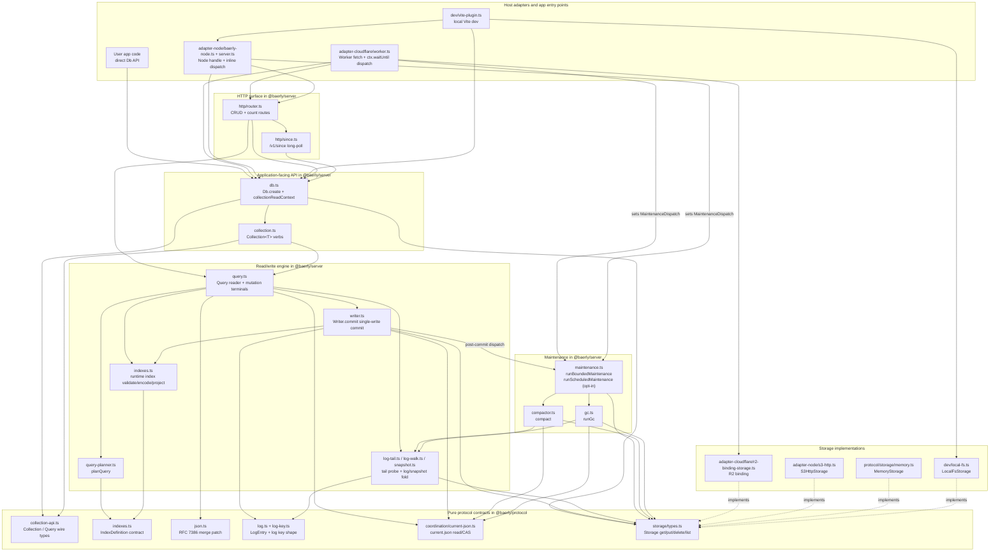

# Architecture

A top-down map of baerly-storage for someone who has never opened the
codebase.

## One-paragraph summary

A client writes by uploading content and index artifacts to
S3-compatible storage, then creating one per-doc `LogEntry` at
`log/<seq>.json` with `If-None-Match: "*"`. The write completes when
that numbered `log/<seq>` create wins — that create **is** the commit.
There is no `current.json` write on the commit path. `current.json` is
compactor-owned compaction state: it names the snapshot, carries the
`log_seq_start` invariant, and carries a non-authoritative `tail_hint`
(a monotone lower bound for the live tail). Reads explicitly fetch
`current.json`, load the snapshot it names, fold the trusted range
`[log_seq_start, tail_hint)`, then forward-probe the log to the first
404 to discover the true tail, folding `LogEntry` rows into a live row
set, and evaluate the query predicate. Change notifications are delivered
out-of-band by the HTTP
`/v1/since?collection=<name>&cursor=<opaque>` long-poll route. The
protocol is specified in
[spec/sync-protocol.md](../spec/sync-protocol.md) and proven causally consistent in
[spec/causal-consistency-checking.md](../spec/causal-consistency-checking.md).

Built like git: content-addressed documents, immutable numbered log
entries, and one conditional log create as the commit, per collection.
This shape is the same recipe Iceberg, Delta Lake, Turbopuffer,
Litestream, and SlateDB converged on after S3 went strongly consistent
in December 2020 (see
[spec/storage-compatibility.md](../spec/storage-compatibility.md)). The novel
part is not the kernel; it is shaping the system so the public API
stays small enough that an LLM can use it from `.d.ts` alone (see
[ADR-002](../adr/002-api-surface-lock.md)).

Bundle sizes set the scope: the full Cloudflare Workers bundle
(`cloudflare.js`) is ~113 KB gzipped; the Node HTTP closure
(`http.js`) is ~94 KB gzipped; the browser client (`client.js`)
is ~5 KB gzipped. The whole public API surface fits in a single
~12k-token `dist/API.md`.

## Runtime model

**There is no runtime. None.** All coordination is bounded to the
request path or an explicit SDK maintenance invocation — no daemon, no
leader, no coordinator service. Cloudflare can finish a write-triggered
maintenance tick after the response with `ctx.waitUntil`; Node runs it
inline unless the host wraps dispatch differently. A request enters the
Worker/Node handler; the handler constructs a
`Db` via `Db.create({ storage, config })`; the `Db` reads a fresh
`current.json` from the bucket (no warm-cache shortcut for
correctness — `consistency: "strong"` does this explicitly); it
does the work — query evaluation, conflict resolution, the
committing `log/<seq>` create — and exits. No background thread runs between
requests, and no in-memory state from one request is load-bearing
for the next: the next request re-reads `current.json` from the
bucket.

Maintenance has the same shape, but it is **triggered in-band on
the write path**, not by a scheduler. After a successful commit
the writer dispatches a bounded maintenance pass (see
[the maintenance subsection](#after-the-write--the-in-band-maintenance-tick)
below). The pass is sized to fit inside the platform's subrequest
budget — Cloudflare Workers' 50-subrequest limit is the tightest
target — so larger backlogs drain across many write-ticks rather
than spilling into a long-lived process. The opt-in
[`runScheduledMaintenance`](../../packages/server/src/maintenance.ts)
SDK can still be driven from a cron trigger, but it is not the
default and not required. The rationale is in
[ADR-004](../adr/004-ephemeral-coordination.md).

## Module dependency graph

A curated, layer-grouped view of the load-bearing modules — not every
file in the path. Solid arrows mean a dependency or call path at this
level of abstraction; dashed arrows mean **implements**. Intermediate
plumbing is collapsed where it mainly explains an edge, but the
snapshot/log readers are shown explicitly because they are the shared
read-side path behind both queries and maintenance.

## CLI surfaces

Two CLIs ship from this repo, and the split is load-bearing:

- **`@gusto/create-baerly-storage`** (`packages/create-baerly-storage/`) puts baerly into a
  project — either by scaffolding from a template in `examples/` or by
  bolting onto an existing Cloudflare Worker (`pnpm create @gusto/baerly-storage@latest .`).
  It is the only npm-published CLI besides `baerly-storage` itself.
- **`baerly`** (`packages/cli/`) does things to a project that already
  has baerly-storage: `deploy`, `doctor`, `inspect`, `export`, `cost`,
  and the `admin` subgroup. Workspace-internal; bundled to a single-file bin at
  `dist/baerly.js` that the `baerly-storage` tarball ships.

The two share one helper module — `@baerly/cli/wrangler-patch` — because
both `baerly deploy --target=cloudflare` and `@gusto/create-baerly-storage`'s bolt-on
flow merge into the same `wrangler.jsonc`. Everything else stays in its
own package. See `packages/cli/AGENTS.md` and
`packages/create-baerly-storage/AGENTS.md` for the per-package quickrefs.

## Lifecycle of `db.collection("X").insert(doc)`

1. **`Collection.insert(doc)`** (`packages/server/src/collection.ts`):
   normalises the document, generates a UUIDv7 `_id` if absent,
   constructs a `CommitInput{ op: "I", collection, docId, body }`,
   and calls `Writer.commit(...)`.

2. **`Writer.commit(req)`**
   (`packages/server/src/writer.ts`): reads `current.json`
   fresh for its snapshot pointer and `tail_hint`, forward-probes
   from `tail_hint` to find the first empty log slot and mint
   `seq`, PUTs the content body under
   `app/<app>/tenant/<tenant>/manifests/<collection>/content/<sha>.json`,
   PUTs additive (new) index artifacts under
   `app/<app>/tenant/<tenant>/manifests/<collection>/index/...`
   **before** the commit, then creates the log entry under
   `app/<app>/tenant/<tenant>/manifests/<collection>/log/<seq>.json`
   with `If-None-Match: "*"` — **that create is the commit** (no
   `current.json` write on the commit path) — and finally DELETEs
   stale index keys after the commit. A `412` on the log create
   means the slot is taken: the writer reads the occupant back, and
   if it is foreign (a peer genuinely won) re-probes the next seq
   and retries up to `S3_REQUEST_MAX_RETRIES` (default 8); a
   same-session occupant is its own lost-ack write and is adopted.
   When the budget is exhausted against a foreign occupant the
   writer surfaces `BaerlyError{code:"Conflict"}`. There is no
   post-commit fence verify; `writer_fence` is dormant.

3. **Read path: `Collection.where(p).all()`**
   (`packages/server/src/query.ts`): reads `current.json`, loads the
   snapshot it names, folds the trusted range `[log_seq_start,
tail_hint)` from object storage and then forward-probes
   `[tail_hint, true tail)` to the first 404, folds the `LogEntry`
   stream into the live row set
   (`I` / `U` apply the doc body; `D` removes the doc), evaluates the
   predicate AST from `where()` / `order()` / `limit()`, and returns the
   filtered rows.

#### Planner step (between the predicate and the log fold)

When `Collection.where(p).all()` has a predicate AND the collection has
declared `indexes`, the reader calls `planQuery(predicate, indexes)`
(in `packages/server/src/query-planner.ts`) after the `current.json`
read and before the log fold. The planner returns either
`IndexWalkPlan{indexName, equalityKeys, rangeOn?, inOn?}`
— which routes the reader through `runIndexWalkPlan(plan, ctx, head)`
to LIST under the encoded index prefix and resolve only the matching
doc ids — or `FullScanPlan{reason}` — which falls through to the
snapshot+log fold. Every fetched row passes through
`matchesWire(wire, doc)` post-fetch; the re-check is load-bearing
(it defends against stale extra index entries and consumes any
residual clauses from the original wire predicate). Missing index
entries can hide rows from an index-routed query, so newly declared or
suspect indexes must be reconciled with `rebuildIndex` before operators
treat them as complete. The plan shape and diagnostic `reason` values
are documented
in [features.md](features.md) §"Secondary indexes".

The HTTP `/v1/since?collection=<name>&cursor=<opaque>` long-poll route in
`packages/server/src/http/since.ts` is the change-notification
channel: it walks the log from a caller-supplied cursor and
either returns the new entries immediately or holds the request
until new entries arrive (or the long-poll deadline elapses).
The protocol-level theory lives in
[spec/sync-protocol.md](../spec/sync-protocol.md).

### After the write — the in-band maintenance tick

Durability + space reclamation happen **in-band on the write
path**, from a **single trigger site**: the writer's post-commit
dispatch point (`packages/server/src/writer.ts`). After the commit
lands, the writer reads a per-request `MaintenanceDispatch` off
the observability context (`getCurrentContext()?.maintenance`,
set by the adapter) and calls `runBoundedMaintenance`
(`packages/server/src/maintenance.ts`). **Reads are pure — they
never tick.** A bare `Db.create(...)` maintains out of the box
once enough writes accrue; there is no `setInterval`, no cron, no
operator scheduler.

The bounded pass composes the two existing primitives:

- `runGc()` (`packages/server/src/gc.ts`) — the two-phase
  mark/sweep into `gc/pending.json`, **budgeted** per tier
  (`WRITE_TICK_GC_MAX_MARKS` / `..._SWEEPS`) and run on its
  **own write-count cadence** (`WRITE_TICK_GC_INTERVAL`,
  boundary-crossing) **decoupled from folds**. It deletes content
  bodies, stale log entries, and orphan snapshots no longer reachable
  from `current.json`.
- `compact()` (`packages/server/src/compactor.ts`) — folds a
  **sliced** tail into the snapshot and advances `log_seq_start`
  (the slice size is `maxFoldEntriesPerPass`, passed to `compact()`
  as `maxEntriesPerRun`). The unsliceable snapshot rebuild is
  gated by a **static two-way ceiling** (`snapshot_bytes <= C`
  AND `snapshot_rows + maxFoldEntriesPerPass <= E`). The byte ceiling is
  overridable by `BAERLY_MAINTENANCE_MAX_FOLD_BYTES`; the row ceiling
  is a kernel constant.

The fold's pointer advance is a **full-fence CAS**. A lost fold
is abandoned (**no lease**); its orphan snapshot is reclaimed by
`runGc` past the grace window. **Dispatch is by capability:**
Cloudflare relocates the fold past the response via
`ctx.waitUntil`; everywhere else it runs inline
(`dispatchInlineAwaited`). See
[graduation.md](../about/graduation.md) for the per-tier envelope
and ceiling math, and "Storage layout in the bucket" below for
the on-disk shape these passes produce.

## Storage seam

The kernel reads and writes through the four `Storage` methods only
(`get`/`put`/`delete`/`list`). `Storage` is injected at
`Db.create({ storage, app, tenant })` time; the kernel never
picks an impl itself.

- `S3HttpStorage` (`packages/adapter-node/src/s3-http.ts`) for any
  HTTP endpoint from a Node host. Authentication plugs in via an
  injected `sign(req)` callback — `S3HttpStorage` imports no signer
  itself; the `s3Storage` / `r2Storage` / `minioStorage` /
  `gcsStorage` factories exported from `@gusto/baerly-storage/node`
  wire `aws4fetch`'s SigV4 in for you, so production callers reach
  for those instead of constructing it directly.
- `MemoryStorage` (`packages/protocol/src/storage/memory.ts`) for
  the `memory:` endpoint, partitioned per bucket via a
  process-singleton map so multiple `Db` instances share state by
  bucket name.
- `LocalFsStorage` (`packages/dev/src/local-fs.ts`, ships in the
  Node-only `@baerly/dev` package — not part of the runtime bundle
  since the kernel can't depend on `node:fs`) backs the `baerlyDev()`
  Vite plugin (which the `examples/minimal-node/` and
  `examples/react-node/` scaffolds use as `pnpm dev`) against a fixture
  directory. Content-addressed `"<sha-256-hex>"` ETags so identical
  bodies match across runs; atomic writes via `write-temp + rename`.
  Callers construct it directly and inject it where a `Storage` is
  required.
- `r2BindingStorage` (`packages/adapter-cloudflare/src/r2-binding-storage.ts`)
  for Cloudflare Workers. Wraps an R2 bucket binding, no HTTP hop.

The protocol kernel landing at three independent runtimes
(Cloudflare Workers, Node, AWS Lambda) is a load-bearing design
constraint: anything platform-specific has to live in an adapter.

## Where invariants live

- **Causal consistency:** `packages/server/src/writer.ts` and
  `packages/server/src/query.ts` — the writer mints `LogEntry.seq`
  as the first empty log slot found by the forward-probe from
  `tail_hint`, and the winning `log/<seq>` `If-None-Match: "*"`
  create is the commit; the reader folds `[log_seq_start, tail_hint)`
  from a single read of `current.json` and forward-probes the tail.
  A reader's observed sequence is a prefix of the collection log.
  Proof:
  [spec/causal-consistency-checking.md](../spec/causal-consistency-checking.md).
- **Split-brain fencing:** `writer_fence.epoch` inside `current.json`
  is **dormant** under single-write commit — the post-commit fence
  verify was removed (the winning `log/<seq>` create is itself the
  proof of commit), and no prod path reads or writes the field. Its
  drop is deferred (see [ADR-008](../adr/008-single-write-commit.md)).
- **JSON Merge Patch semantics:** `packages/protocol/src/json.ts` —
  RFC 7386 with the array-replacement convention; see
  [spec/json-merge-patch.md](../spec/json-merge-patch.md).
- **Log entry shape:** `packages/protocol/src/log.ts` — the on-the-wire
  `LogEntry` interface, stable at major versions. See
  [spec/log-entry-shape.md](../spec/log-entry-shape.md).

## Key types (where the contracts live)

- `Db` (`packages/server/src/db.ts`): public read/write surface.
  `Db.create({ storage, app, tenant })` returns a tenant-scoped
  handle; `db.collection<T>(name)` returns a `Collection<T>`.
- `Collection<T>` / `Query<T>` (`@baerly/protocol`,
  consumed by `packages/server/src/collection.ts` and
  `packages/server/src/query.ts`): the locked SQL-shape API.
  Mutations (`insert` / `update` / `replace` / `delete`) plus the
  predicate AST (`where` / `order` / `limit` /
  `first` / `all` / `count`).
- `CommitInput` / `CommitResult`
  (`packages/server/src/writer.ts`): the
  `Writer.commit` request/response shapes.
- `LogEntry` (`packages/protocol/src/log.ts`): the per-mutation log
  entry. Field set is fixed at major versions; consumers ack on
  `lsn`. Full contract in [spec/log-entry-shape.md](../spec/log-entry-shape.md).
- `Branded<T, B>` (`packages/protocol/src/types.ts`): nominal-type
  pattern. `UUID` and `ContentVersionId` are both `string`s but not
  assignable to each other.
- `BaerlyError` / `BaerlyErrorCode` (`packages/protocol/src/errors.ts`):
  discriminated-union error type. Branch on `error.code`.
- `loadSnapshotAsMap(storage, key, expectedCollection, signal?)`
  (`packages/server/src/snapshot.ts`): `@public` shared utility —
  fetches a snapshot from object storage, verifies the SHA-256
  baked into the filename, and returns a `Map<_id, body>`. Internal
  callers: the compactor's fold-base load, the reader
  (`Query.runRead`), `runGc`, `rebuildIndex`, `migrate`. See
  [extending.md §5](extending.md#5-shared-utilities-on-the-public-surface).

## Storage layout in the bucket

For a `Db` constructed with `app="tickets"` and `tenant="acme"`:

- `app/tickets/tenant/acme/manifests/<collection>/current.json` —
  compactor-owned compaction state. Holds the snapshot pointer,
  `log_seq_start`, the non-authoritative `tail_hint`, and the dormant
  `writer_fence`. Not the commit-path linearization point.
- `app/tickets/tenant/acme/manifests/<collection>/log/<seq>.json` — one
  object per `LogEntry`, keyed by monotonic integer `seq`. The
  `If-None-Match: "*"` create on this key is the commit. Read by
  readers across the trusted range `[log_seq_start, tail_hint)` plus a
  forward-probe to the true tail.
- `app/tickets/tenant/acme/manifests/<collection>/content/<content-version>.json` —
  content-addressed post-image body for `I` / `U`, keyed by the
  `ContentVersionId` (SHA-256 truncated to 32 hex chars).
- `app/tickets/tenant/acme/manifests/<collection>/index/<name>/...` —
  zero-byte advisory index marker.
- `app/tickets/tenant/acme/manifests/<collection>/snapshot/L9/<min>-<max>-<sha>.json` —
  content-hashed materialized snapshot.
- `app/tickets/tenant/acme/manifests/<collection>/gc/pending.json` —
  two-phase GC candidate ledger.

Compaction (`packages/server/src/compactor.ts`) folds adjacent log
entries into checkpoints and advances `log_seq_start`. GC
(`packages/server/src/gc.ts`) deletes content bodies, stale log
entries, and orphan snapshots that are no longer reachable from
`current.json`.
Both are driven in-band on the write path by
`runBoundedMaintenance` (`packages/server/src/maintenance.ts`);
the `runScheduledMaintenance` SDK is an opt-in alternative
trigger. See
[After the write — the in-band maintenance tick](#after-the-write--the-in-band-maintenance-tick).
