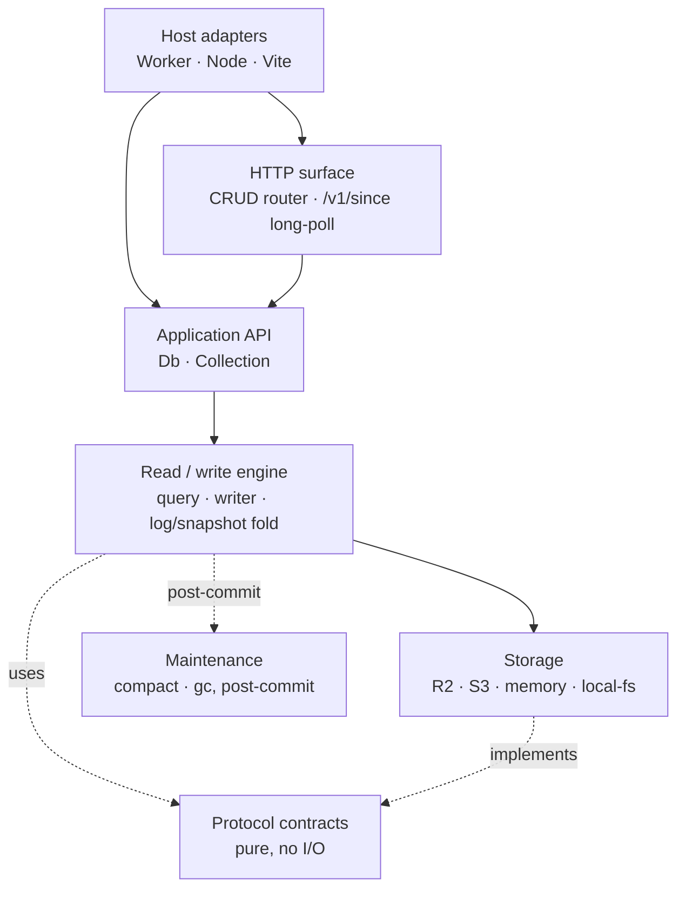
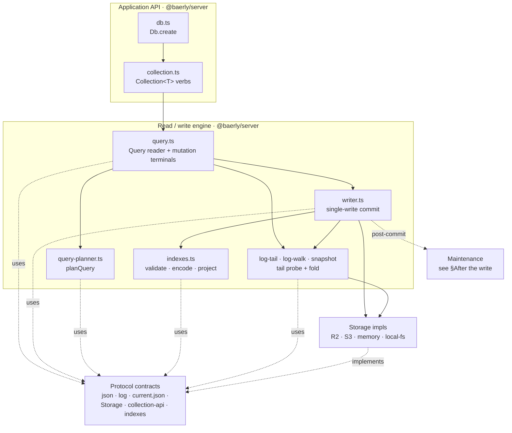

# Architecture

A top-down map of baerly-storage for someone who has never opened the
codebase.

## Core idea

Start with the only shared thing every request can see: a bucket object.
In this doc, a bucket object is bytes stored at a key. `PUT` writes an
object, `If-None-Match: "*"` makes that write create-only, and a `404`
means the key is absent.

The hard part is deciding which writer won without a database server.
Baerly makes each commit attempt race on one numbered log slot. A write
commits only when one writer conditionally creates one new numbered
object: `log/<seq>.json`. If another writer already owns that slot, the
loser reads it, re-probes forward, and tries the next empty slot.
`current.json` does not commit writes. Everything before the create
prepares data a future reader will need; everything after it is cleanup
or maintenance.

Concretely, a writer uploads content and index artifacts to S3-compatible
storage, then tries to create one per-doc `LogEntry` at `log/<seq>.json`
with `If-None-Match: "*"`. The write completes when that numbered
`log/<seq>` create wins — that create **is** the commit. There is no
`current.json` write on the commit path. `current.json` is compactor-owned
compaction state: it names the snapshot, stores `log_seq_start` (the
first log seq not covered by that snapshot), and carries a
non-authoritative `tail_hint`.

`tail_hint` is a monotone lower bound on the true tail that tells
readers where to start probing; it may lag. The live tail is exact: the
first missing sequence after the committed log entries.

Reads use `current.json` as a starting point, not as a verdict about the
tail. They load the snapshot it names, fold the trusted range
`[log_seq_start, tail_hint)`, then forward-probe the log from
`max(log_seq_start, tail_hint)` to the first 404 to discover the true
tail. To fold a range is to replay its log entries into the in-memory row
map; trusted means the range must be dense, so a missing entry is
corruption rather than the end of the log. The right edge of
`[log_seq_start, tail_hint)` is exclusive: with `log_seq_start = 2` and
`tail_hint = 5`, the trusted range is `2`, `3`, `4`; the reader still
probes `5`, `6`, ... until it sees a missing key. Folding those
`LogEntry` rows produces the live row set; query predicates run against
that row set. Change notifications are delivered out-of-band by the HTTP
`/v1/since?collection=<name>&cursor=<opaque>` long-poll route. The
protocol is specified in
[spec/sync-protocol.md](../spec/sync-protocol.md) and proven causally
covered by the randomized causal-consistency checker in
[spec/causal-consistency-checking.md](../spec/causal-consistency-checking.md).

The useful git comparison is narrow: content-addressed documents,
immutable numbered log entries, and one conditional log create as the
commit, per collection. Comparable object-storage systems use the same
shape after S3 went strongly consistent in December 2020: successful
creates and listings become visible without a database server or lock
service (see
[spec/storage-compatibility.md](../spec/storage-compatibility.md)).

Bundle-size budgets set the scope: the full Cloudflare Workers bundle
(`cloudflare.js`) is capped at 117 KiB gzipped; the Node HTTP closure
(`http.js`) at 99 KiB; the browser client (`client.js`) at 6 KiB. The
whole public API surface fits in a single ~12k-token `dist/API.md`, so
an LLM can use it from `.d.ts` alone (see
[ADR-002](../adr/002-api-surface-lock.md)).

## Runtime model

**There is no separate database server.** The bucket is the durable
shared state. The Worker/Node handler is stateless per-request app code
that has bucket credentials; correctness must survive losing the process.

A request enters the handler; the handler constructs a `Db` via
`Db.create({ storage, app, tenant, config? })` (`app` and `tenant` are
bucket-prefix namespace segments such as `app/tickets/tenant/acme/...`);
the `Db` reads a fresh `current.json` from the bucket, does the work —
query evaluation, conflict resolution, the committing `log/<seq>`
create — and returns. Reads are strong by construction because each
request fetches `current.json`; there is no warm-cache shortcut for
correctness. Cloudflare can finish a write-triggered maintenance tick
after the response with `ctx.waitUntil`; Node runs it inline unless the
host wraps dispatch differently. No background thread runs between
requests, and no in-memory state from one request is load-bearing for
the next.

Maintenance is **triggered in-band on the write path**, not by a
scheduler. After a successful commit, the request may start at most one
maintenance attempt with a fixed budget; if no maintenance is due, it
does nothing, and leftover work waits for later writes. See
[the maintenance subsection](#after-the-write--the-in-band-maintenance-tick)
below. The pass is sized to fit inside the platform's subrequest
budget — Cloudflare Workers' 50-subrequest limit is the tightest
target — so larger backlogs drain across many write-ticks rather
than spilling into a long-lived process. The opt-in
[`runScheduledMaintenance`](../../packages/server/src/maintenance.ts)
SDK can still be driven from a cron trigger, but it is not the
default and not required. The rationale is in
[ADR-004](../adr/004-ephemeral-coordination.md).

## Module dependency graph

A request flows top-to-bottom through a few layers; the engine leans on
a column of pure protocol contracts and triggers maintenance after a
commit. The first diagram is that whole picture in one glance. The
second zooms into the read/write engine — the part you touch when
changing `writer.ts` or the query path.

Solid arrows are a direct dependency or call path. Dashed arrows are a
looser relationship: **uses** a pure contract, **implements** an
interface, or triggers work **post-commit**.

### Layers at a glance



A write flows host → API → engine → storage; a read folds storage back
up through the engine. `Protocol` is the pure contract layer: data
shapes and the `Storage` interface shared by the rest of the system.
`Maintenance` (compaction + GC) is post-commit work, not part of the
commit decision: Cloudflare can dispatch it off-response; Node/default
dispatch can run it inline (see
[After the write](#after-the-write--the-in-band-maintenance-tick)).

### The engine, exploded

Host adapters, the HTTP surface, the maintenance loop, and the
individual protocol modules collapse to single boxes here — each is
detailed in the prose below ("Storage seam", "After the write") and in
the module map in `CLAUDE.md`. What remains is the application API and
the read/write engine: the modules behind `db.collection(...).insert()`
and `.where(...).all()`.



## CLI surfaces

Two CLIs ship from this repo, and the split is load-bearing:

- **`@gusto/create-baerly-storage`** (`packages/create-baerly-storage/`)
  puts baerly-storage into a project — either by scaffolding from a
  template in `examples/` or by bolting onto an existing Cloudflare
  Worker (`pnpm create @gusto/baerly-storage@latest .`). It is the only
  npm-published CLI besides `baerly-storage` itself.
- **`baerly`** (`packages/cli/`) does things to a project that already
  has baerly-storage: `deploy`, `doctor`, `inspect`, `export`, `cost`,
  and the `admin` subgroup. Workspace-internal; bundled to a single-file bin at
  `dist/baerly.js` that the `baerly-storage` tarball ships.

The two share one helper module — `@baerly/cli/wrangler-patch` — because
both `baerly deploy --target=cloudflare` and `@gusto/create-baerly-storage`'s bolt-on
flow merge into the same `wrangler.jsonc`. Everything else stays in its
own package. See `packages/cli/AGENTS.md` and
`packages/create-baerly-storage/AGENTS.md` for the per-package quickrefs.

## Lifecycle of `db.collection("X").insert(doc)`

Write ordering is asymmetric: content bodies and new index markers are
visible before the `log/<seq>` create; stale index markers are deleted
after commit. A row becomes visible only when a committed log entry is
replayed; content and index objects alone are ignored as rows. Index
markers are zero-byte objects used to find candidate doc ids.

1. **`Collection.insert(doc)`** (`packages/server/src/collection.ts`):
   normalises the document, generates a UUIDv7 `_id` if absent,
   constructs a `CommitInput{ op: "I", collection, docId, body }`,
   and calls `Writer.commit(...)`.

2. **`Writer.commit(req)`**
   (`packages/server/src/writer.ts`): reads `current.json` fresh for
   its snapshot pointer and `tail_hint`, then forward-probes from
   `max(log_seq_start, tail_hint)` to find the first empty log slot and
   mint `seq`. It PUTs the content body under
   `app/<app>/tenant/<tenant>/manifests/<collection>/content/<sha>.json`
   and PUTs additive (new) index artifacts under
   `app/<app>/tenant/<tenant>/manifests/<collection>/index/...`
   **before** the commit. It then creates the log entry under
   `app/<app>/tenant/<tenant>/manifests/<collection>/log/<seq>.json`
   with `If-None-Match: "*"` — **that create is the commit** (no
   `current.json` write on the commit path) — and finally DELETEs stale
   index keys after the commit. A `412` on the log create means the key
   already exists. The writer reads the existing `LogEntry`: same
   session means this write likely committed but lost its response, so
   the writer adopts it; foreign session means another writer won, so
   the writer re-probes until it finds the next empty slot. That
   re-probe is bounded by `LOG_FORWARD_PROBE_CAP`; exhausting it
   surfaces `BaerlyError{code:"Internal"}`. There is no post-commit
   fence verify; `writer_fence` is dormant.

3. **Read path: `Collection.where(p).all()`**
   (`packages/server/src/query.ts`): reads `current.json`, loads the
   snapshot it names, folds the trusted range `[log_seq_start,
   tail_hint)` from object storage and then forward-probes
   `[max(log_seq_start, tail_hint), true tail)` to the first 404, folds
   the `LogEntry` stream into the live row set
   (`I` / `U` apply the doc body; `D` removes the doc), evaluates the
   predicate AST from `where()` / `order()` / `limit()`, and returns the
   filtered rows.

#### Planner step (between the predicate and the log fold)

The committed log, folded over the snapshot, is the row truth; indexes
only choose candidate doc ids. Extra stale markers add work because the
fetched row still has to pass the same predicate check a full scan would
apply. Missing markers can hide rows from an index-routed query, so index
completeness is operationally significant.

Concretely, when `Collection.where(p).all()` has a predicate AND the
collection has declared `indexes`, the reader calls
`planQuery(predicate, indexes)` (in
`packages/server/src/query-planner.ts`) after the `current.json` read
and before the log fold. The planner returns either
`IndexWalkPlan{indexName, equalityKeys, rangeOn?, inOn?}`
— which routes the reader through `runIndexWalkPlan` to LIST under the
encoded index prefix and resolve only the matching doc ids — or
`FullScanPlan{reason}` — which falls through to the snapshot+log fold.
Every fetched row passes through a post-fetch `matchesWire(...)`
re-check; it defends against stale extra index entries and consumes any
predicate clauses the index did not cover. Newly declared or suspect
indexes must be reconciled with `rebuildIndex` before operators treat
them as complete. Filtered indexes add one more condition: marker
completeness is sound only when the query implies the index filter. The
plan shape, diagnostic `reason` values, and filtered-index caveat are
documented
in [features.md](features.md) §"Secondary indexes".

The HTTP `/v1/since?collection=<name>&cursor=<opaque>` long-poll route in
`packages/server/src/http/since.ts` is the change-notification
channel: it walks the log from a caller-supplied cursor and
either returns the new entries immediately or holds the request
until new entries arrive (or the long-poll deadline elapses).
The protocol-level theory lives in
[spec/sync-protocol.md](../spec/sync-protocol.md).

### After the write — the in-band maintenance tick

Compaction keeps reads from replaying old log entries; GC removes
orphaned objects. Both still obey the no-daemon rule: the writer's
post-commit dispatch point (`packages/server/src/writer.ts`) is the
single default in-band trigger site for this work.

After the commit lands, the writer reads a per-request
`MaintenanceDispatch` off the observability context
(`getCurrentContext()?.maintenance`, set by the adapter) and calls
`runBoundedMaintenance` (`packages/server/src/maintenance.ts`). **Reads
are pure — they never tick.** A `Db.create(...)` instance dispatches
maintenance after enough writes accrue; no `setInterval`, cron, or
operator scheduler is required.

The bounded pass splits that work across two existing primitives:

- `runGc()` (`packages/server/src/gc.ts`) deletes content bodies, stale
  log entries, and orphan snapshots no longer reachable from
  `current.json` after the grace window. It uses the two-phase
  mark/sweep ledger at `gc/pending.json`, is bounded by the maintenance
  profile's `gcMaxMarks` / `gcMaxSweeps`, and is due on `gcInterval`
  write-count boundary crossings. In `"single"` phase mode, a fold can
  take the tick when both are due; the hard-GC guard prevents indefinite
  starvation.
- `compact()` (`packages/server/src/compactor.ts`) folds a **sliced**
  tail into a new snapshot and advances `log_seq_start` so future reads
  replay less log. The slice size is `maxFoldEntriesPerPass`, passed to
  `compact()` as `maxEntriesPerRun`. The unsliceable snapshot rebuild is
  gated by a **static two-way ceiling** (`snapshot_bytes <= C` AND
  `snapshot_rows + maxFoldEntriesPerPass <= E`). The byte ceiling is
  overridable by `BAERLY_MAINTENANCE_MAX_FOLD_BYTES`; the row ceiling is
  a kernel constant.

Snapshot pointer advancement: a fold writes a new snapshot, then
advances `current.json` with a **full-fence CAS** — a conditional update
that succeeds only if the previously read state still matches. A lost
fold is abandoned (**no lease**; no lock object is taken); its orphan
snapshot is reclaimed by `runGc` past the grace window. **Dispatch is by
capability:** Cloudflare relocates the maintenance pass past the
response via `ctx.waitUntil`; everywhere else it runs inline
(`dispatchInlineAwaited`). See
[graduation.md](../about/graduation.md) for the per-tier envelope
and ceiling math, and "Storage layout in the bucket" below for
the on-disk shape these passes produce.

## Storage seam

The kernel's portability comes from a small boundary: it knows object
operations, not providers. It reads and writes through the four
`Storage` methods only (`get`/`put`/`delete`/`list`). `Storage` is
injected at `Db.create({ storage, app, tenant })` time; the kernel
never picks an impl itself.

- `S3HttpStorage` (`packages/adapter-node/src/s3-http.ts`) for any
  HTTP endpoint from a Node host. Authentication plugs in via an
  injected `sign(req)` callback — `S3HttpStorage` imports no signer
  itself; the `s3Storage` / `r2Storage` / `minioStorage` /
  `gcsStorage` factories exported from `@gusto/baerly-storage/node`
  wire `aws4fetch`'s SigV4 in for you. Production callers should use
  AWS S3 or Cloudflare R2; MinIO is the local conformance target, and
  GCS S3-interop is unsupported for database use today.
- `MemoryStorage` (`packages/protocol/src/storage/memory.ts`) for
  the `memory:` endpoint, partitioned per bucket via a
  process-singleton map so multiple `Db` instances share state by
  bucket name.
- `LocalFsStorage` (`packages/dev/src/local-fs.ts`, ships in the
  Node-only `@baerly/dev` package — not part of the runtime bundle
  since the kernel can't depend on `node:fs`) backs the `baerlyDev()`
  Vite plugin (which the `examples/minimal-node/` and
  `examples/react-node/` scaffolds use as `pnpm dev`) against a fixture
  directory. Content-addressed `"<sha-256-hex>"` ETags so identical
  bodies match across runs; atomic writes via `write-temp + rename`.
  Callers construct it directly and inject it where a `Storage` is
  required.
- `r2BindingStorage` (`packages/adapter-cloudflare/src/r2-binding-storage.ts`)
  for Cloudflare Workers. Wraps an R2 bucket binding, no HTTP hop.

Cloudflare Workers and Node are supported today; AWS Lambda requires an
adapter package. Platform-specific code belongs in adapters.

## Where invariants live

- **Causal consistency:** `packages/server/src/writer.ts` and
  `packages/server/src/query.ts` — the writer mints `LogEntry.seq`
  as the first empty log slot found by the forward-probe from
  `max(log_seq_start, tail_hint)`, and the winning `log/<seq>`
  `If-None-Match: "*"` create is the commit; the reader folds
  `[log_seq_start, tail_hint)` from a single read of `current.json` and
  forward-probes from `max(log_seq_start, tail_hint)`.
  A reader's observed sequence is a prefix of the collection log.
  Randomized checker:
  [spec/causal-consistency-checking.md](../spec/causal-consistency-checking.md).
- **Split-brain fencing:** `writer_fence.epoch` inside `current.json`
  is **dormant** under single-write commit — the post-commit fence
  verify was removed (the winning `log/<seq>` create is itself the
  proof of commit), and no prod path reads or writes the field. Its
  drop is deferred (see [ADR-008](../adr/008-single-write-commit.md)).
- **JSON Merge Patch semantics:** `packages/protocol/src/json.ts` —
  RFC 7386 with the array-replacement convention; see
  [spec/json-merge-patch.md](../spec/json-merge-patch.md).
- **Log entry shape:** `packages/protocol/src/log.ts` — the on-the-wire
  `LogEntry` interface, with pre-launch narrowing rules and
  post-consumer major-version stability. See
  [spec/log-entry-shape.md](../spec/log-entry-shape.md).

## Key types (where the contracts live)

- `Db` (`packages/server/src/db.ts`): public read/write surface.
  `Db.create({ storage, app, tenant })` returns a tenant-scoped
  handle; `db.collection<T>(name)` returns a `Collection<T>`.
- `Collection<T>` / `Query<T>` (`@baerly/protocol`,
  consumed by `packages/server/src/collection.ts` and
  `packages/server/src/query.ts`): the locked SQL-shape API.
  Mutations (`insert` / `update` / `replace` / `delete`) plus the
  predicate AST (`where` / `order` / `limit` /
  `first` / `all` / `count`).
- `CommitInput` / `CommitResult`
  (`packages/server/src/writer.ts`): the
  `Writer.commit` request/response shapes.
- `LogEntry` (`packages/protocol/src/log.ts`): the per-mutation log
  entry. Field set is fixed at major versions; consumers ack on
  `lsn`. Full contract in [spec/log-entry-shape.md](../spec/log-entry-shape.md).
- `Branded<T, B>` (`packages/protocol/src/types.ts`): nominal-type
  pattern. `UUID` and `ContentVersionId` are both `string`s but not
  assignable to each other.
- `BaerlyError` / `BaerlyErrorCode` (`packages/protocol/src/errors.ts`):
  discriminated-union error type. Branch on `error.code`.
- `loadSnapshotAsMap(storage, key, expectedCollection, signal?)`
  (`packages/server/src/snapshot.ts`): `@public` shared utility —
  fetches a snapshot from object storage, verifies the SHA-256
  baked into the filename, and returns a `Map<_id, body>`. Internal
  callers: the compactor's fold-base load, the reader
  (`Query.runRead`), `runGc`, `rebuildIndex`. See
  [extending.md §5](extending.md#5-shared-utilities-on-the-public-surface).

## Storage layout in the bucket

Every object for one collection lives under one prefix: `log/` holds
commits; `content/`, `index/`, `snapshot/`, and `gc/` support reads and
maintenance. For a `Db` constructed with `app="tickets"` and
`tenant="acme"`, that prefix is the tree root below — shown once here,
then omitted from the table that follows:

```
app/tickets/tenant/acme/manifests/<collection>/
├── current.json                   ← compaction state (compactor-owned)
├── log/
│   └── <seq>.json                 ← one LogEntry; THIS create is the commit
├── content/
│   └── <content-version>.json     ← post-image body (insert / update)
├── index/
│   └── <name>/…                   ← advisory marker (zero-byte)
├── snapshot/
│   └── L9/<min>-<max>-<sha>.json  ← materialized snapshot
└── gc/
    └── pending.json               ← GC candidate ledger
```

| Object                               | Key encodes                          | Holds / role                                                                                                                                                                     |
| ------------------------------------ | ------------------------------------ | -------------------------------------------------------------------------------------------------------------------------------------------------------------------------------- |
| `current.json`                       | — (one per collection)               | Snapshot pointer, `log_seq_start`, the non-authoritative `tail_hint`, and the dormant `writer_fence`. **Not** the commit-path linearization point.                               |
| `log/<seq>.json`                     | `seq` — monotonic integer            | One `LogEntry`. The `If-None-Match: "*"` create on this key **is the commit**. Readers scan the trusted range `[log_seq_start, tail_hint)`, then forward-probe to the true tail. |
| `content/<content-version>.json`     | `ContentVersionId` — SHA-256, 32 hex | Content-addressed post-image body for `I` / `U`.                                                                                                                                 |
| `index/<name>/…`                     | index name + encoded key             | Zero-byte advisory index marker.                                                                                                                                                 |
| `snapshot/L9/<min>-<max>-<sha>.json` | `seq` range + content hash           | Content-hashed materialized snapshot.                                                                                                                                            |
| `gc/pending.json`                    | — (one per collection)               | Two-phase GC candidate ledger.                                                                                                                                                   |

Compaction (`packages/server/src/compactor.ts`) folds adjacent log
entries into checkpoints and advances `log_seq_start`. GC
(`packages/server/src/gc.ts`) deletes content bodies, stale log
entries, and orphan snapshots that are no longer reachable from
`current.json`.
Both are driven in-band on the write path by
`runBoundedMaintenance` (`packages/server/src/maintenance.ts`);
the `runScheduledMaintenance` SDK is an opt-in alternative
trigger. See
[After the write — the in-band maintenance tick](#after-the-write--the-in-band-maintenance-tick).
