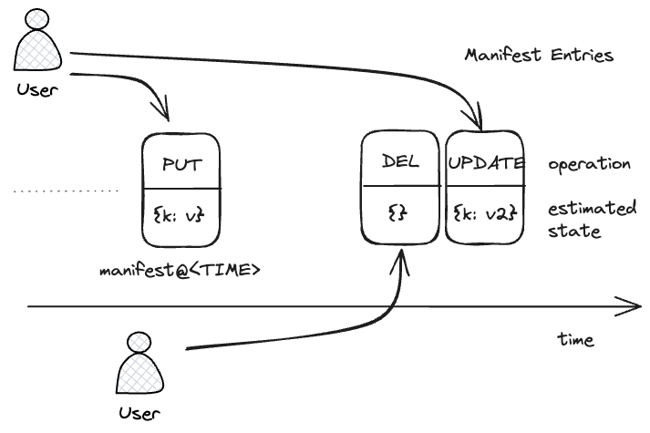

This is a focused explanation of the core sync protocol of Baerly. The sync protocol upgrades an S3 API into a causally consistent, multiplayer datastore without the use of intermediate servers.

## Why build over S3?

1. Minimalism. Why bother maintaining server-side code or a database when the bucket holding the website is a serviceable persistent state store. 

2. Curiosity. Is it even possible to build a database on the S3 API? This project demonstrates that yes it is.

3. Flexibility. Databases are one of the least portable parts of a stack. Decoupling storage from the database enables many more options like self-hosting with minio or using a specialist storage vendor that supports the S3 API.

## Baerly

Baerly is a Key-Value store. The values are stored in versioned storage locations on S3. There is a layer of indirection that maps DB logical keys to storage locations hosted in a *manifest*

### Atomic Multi-key Operations

To enable consistent atomic updates of multiple keys, *first* the client writes the new values, and then it updates the *manifest*, not dissimilar to write-ahead-logging. Other clients use the manifest to access the DB, thus, because individual S3 file updates are atomic, writing a new manifest file is also an atomic operation that can flip the visibility multiple of key updates at once.

The manifest is a layer of *indirection* enabling bulk atomic operation (and more)

### Multiplayer Safe

Concurrent writes would conflict if all clients wrote to the *same* manifest location, and a naive last-write-wins overwrite would silently drop the loser. To support multiplayer each client appends a *different* manifest entry ordered by time, so writers never contend for a single key. Modern S3 *does* offer conditional writes (`If-None-Match: "*"` to create-if-absent, `If-Match: <etag>` to compare-and-swap), and the protocol leans on them — guarding each log append and the single manifest-pointer (`current.json`) advance. See the [S3-CAS prerequisite](#protocol-invariants) below.



The manifest records several major pieces of imperfect information.
- The time of the write, encoded in the key, as measured by the client. Client clocks are subject to clock skew so it might be a bit off.
- The operation that was applied, encoded a JSON merge patch to the DB state.
- The state of the database, but this also might be off because a client doesn't know what other writes are also in flight when written. But it's the client's best guess.

```
// manifest.json@01698260777020_53a_0001
{
    operation: { // Exact JSON-merge-PATCH representation of manifest operation
        keys: {
            "myBucket/oldKey": null, // DELETE
            "myBucket/myKey": {
                version: "2eefe4fb-c540-4482-abb7-f3dfedfc424d"
            }
        }
    },
    state: { // Approximation of current state
        keys: {
            "myBucket/myKey": {
                version: "2eefe4fb-c540-4482-abb7-f3dfedfc424d"
            }
        }
    },
}
```

Much of the engineering of the Baerly sync protocol is about transforming that imperfect information into a causally consistent, atomic, multiplayer safe representation client-side.

### Reconciling concurrent writes

Note the client sends the operation as a [JSON_merge_patch](json-merge-patch.md). The database state at time *t* is the merge concatenation of all the operations up to *t* (see [a list of patches forms an ordered log](json-merge-patch.md#a-list-of-patches-forms-an-ordered-log))

$$state_t = \sum_{i=0}^{t} merge(patch_i)$$
Now it is inefficient for a client to replay the entire DB history. But we can use the [idempotency property of JSON-merge-patch](json-merge-patch.md#) to avoid it.

A client only needs to read an imperfect guess of the latest state, then replay all patches within a *lag* window to correct an estimate of the final state (see [Ordered Logs with missing entries can be repaired with replay](json-merge-patch.md#ordered-logs-with-missing-entries-can-be-repaired-with-replay))

$$\begin{eqnarray} 
state_t &=& state_{t-lag} + \sum_{i=lag}^{t} merge(patch_i) \\
&=& est_t + \sum_{i=lag}^{t} merge(patch_i)
\end{eqnarray}$$

So this is the key insight encoded within Baerly manifest representation. The state field provides a good guess, but clients need to around "a bit" and reapply nearby operations to correct for inflight writes.

### Causal Consistency

If client's clocks are skewed, their manifest keys will not order between them correctly. This does not matter though! To preserve causal consistency, a specific client's writes must remain in the same order for all participants. Clock skew translates, but does not reorder, operations in time, so causal consistency is not undermined.

The sync protocol is eager, exposing all operations as soon as they are visible, so clock skew does not affect end-to-end latency either. The only effect is on ordering within the log which can be observed when writing to the same key. Delayed clients will appear to be affecting the database in the past, which means their operations are more easily masked by other clients.

See [Checking Causal Consistency the Easy Way](causal-consistency-checking.md) describing the randomized property checking used for validating causal consistency.

### Mitigating Large clock skew

Clock skew becomes a consistency-threatening problem if exceeding the *lag* window. Then the reconciliation algorithm will not be looking far enough back and will miss operations. Client clocks cannot be trusted. 

Large clock skew is detected by Baerly by comparing the manifest key timestamp against the server-provided `LastModified` time. If the skew is above a *stale* write threshold it is ignored. As long as the *stale* write threshold is sufficiently below the *lag* parameter, all clients will converge to the same state regardless of clock skew.

### Automatic Clock Adjustment

In addition, clients use the `Date` header to continuously correct their clocks, so clients with heavily skewed clocks can be corrected reactively and continuously and thus capable of joining the log.

### Subtleties of the manifest key

The manifest key is primarily time-ordered, but some extra information is needed to fix edge cases such as: writing on the exact same millisecond or using a sub-millisecond S3 API (such as local-first). So the manifest key format is actually

```
<TIMESTAMP>_<SESSION>_<COUNTER>
```

Furthermore, because S3's `list-objects-v2` operation can only query in ascending lexicographical order, and its more efficient for the algorithm to look backward in descending order, both the timestamp and counter elements are encoded with a reverse lexicographically ordered string. Key length is a limited resource, so we use a Javascript's native base-32 string representation, padded and subtracted from the max value to reverse the directions

```js
export const uint2strDesc = (num: number, bits: number): string => {
  const maxValue = Math.pow(2, bits) - 1;
  return uint2str(maxValue - num, bits);
};

const uint2str = (num: number, bits: number) => {
  const maxBase32Length = Math.ceil(bits / 5);
  const base32Representation = num.toString(32);
  return base32Representation.padStart(maxBase32Length, "0");
};
```

#### Verification of the reverse-lex property

The "lex-asc list of descending-base-32 keys is reverse-causal"
claim is verified two ways:

- **Property test** —
  [`packages/protocol/src/lsn-reverse-list.test.ts`](../../packages/protocol/src/lsn-reverse-list.test.ts)
  asserts the invariant across randomized populations of 2..64
  `(millis, seq)` tuples: for any pair A causally < B,
  `enc(A) > enc(B)` lex, and `MemoryStorage.list(prefix)`
  returns the population in reverse-causal order. The PR-gate
  runs the test at fast-check's default 100 runs; the encoder
  has been verified at `FC_NUM_RUNS=10000` (see commit body).
- **Microbenchmark** —
  [`bench/lsn-reverse-walk.ts`](../../bench/lsn-reverse-walk.ts)
  quantifies bytes-listed reduction vs. the counterfactual
  ascending-base-32 encoding (which would force a full-prefix
  LIST + in-memory reverse). The pinned baseline at
  [`docs/spec/attachments/lsn-reverse-walk-baseline.json`](attachments/lsn-reverse-walk-baseline.json)
  reports, for a 100 000-key population, `bytes_saved_fraction`
  of 99.99% at K=10 and 90% at K=10 000 (analytic ratio K/N
  with fixed-width 37-byte keys). Reproduce with
  `pnpm bench:lsn-reverse-walk`.

### Log entry shape

Every successful manifest write also emits one JSON object per
mutated ref under `<manifest-prefix>/log/<lsn>.json`. The shape
is `LogEntry` (see
[`packages/protocol/src/log.ts`](../packages/protocol/src/log.ts)).
Per-LSN entries (rather than one batched object per manifest)
keep each entry independently fetchable so compaction can sweep
them without touching the manifest log.

Within a single `updateContent` that mutates N refs, N+1 lsns
are minted: 1 for the manifest version, N for the log entries.
Manifest-version lsns and log-entry lsns never alias.

The full contract — fields, what we borrowed from Postgres
logical replication, what we didn't, and the stability rules —
is in [`log-entry-shape.md`](log-entry-shape.md). The shape is
fixed at merge; consumers ack on `lsn` and the JSON keys are
public.

The query planner — `planQuery` in
[`packages/server/src/query-planner.ts`](../../packages/server/src/query-planner.ts)
— sits between the predicate AST and the log fold on the read path.
It does **not** change the wire format: filtered indexes emit fewer
zero-byte entries under the same `<logPrefix>/index/<name>/...` key
shape. See [`docs/contributing/features.md`](../contributing/features.md) §"Secondary indexes"
and [`docs/contributing/architecture.md`](../contributing/architecture.md) §"Planner step
(between the predicate and the log fold)".

### Self-session log-conflict adoption

The writer PUTs each log entry with `If-None-Match: "*"` (see step
5 of `Writer.#singleAttemptCommit` in
[`packages/server/src/writer.ts`](../../packages/server/src/writer.ts)).
A 412 on that PUT means either a peer wrote our `seq` (we lost the
race), OR our own previous attempt landed step 5 but lost the
subsequent `current.json` CAS-advance and we're now re-driving the
same logical commit. The writer discriminates by `session` — the
random 6-hex-char per-commit secret embedded in every emitted
`LogEntry.lsn`.

The decision is isolated in
[`packages/server/src/log-conflict-adoption.ts`](../../packages/server/src/log-conflict-adoption.ts)
(`tryAdoptOwnSessionLogEntry`). Adoption is sound iff three clauses
hold:

1. **Same session.** `existing.session === self.session` — the
   session id is in-RAM-only for the lifetime of one commit; an
   adversary with bucket-write access cannot forge a value they
   did not observe being PUT.
2. **Matching seq.** `existing.seq === self.seq` — implied by
   the key shape (the writer reads back from `/log/<seq>.json`),
   re-asserted at the decision site.
3. **Single-input commit.** `Writer.commit`, not
   `Writer.commitBatch`. Batches surface a log-PUT 412 as
   `Conflict` immediately; the caller (`Db.transaction`) decides
   whether to re-run the body.

When any clause fails, the writer throws
`BaerlyError{code:"Conflict"}`. The adversarial-replay property
test at
[`tests/integration/log-conflict-adversarial.test.ts`](../../tests/integration/log-conflict-adversarial.test.ts)
enumerates the threat model and pins the property "no forged
pre-populated log entry causes the writer to return a commit with
a `LogEntry` it didn't author."

### Minimising list-object-v2 calls

List API calls are costly on S3, they are charged at the same rate as PUTs which are 10x more expensive than GETs. Readers refresh explicitly (via a `get` or a write), and callers that want change-detection drive their own polling, so we want to avoid having the list-object-v2 API call on the hot path of every refresh.

So after writing a new manifest entry, the client then touches a `last_change` file. A reader can check this file first, and only if the content changes (efficiently detected with `If-None-Match` header) does the algorithm proceed to syncing the latest state via the `list-object-v2` API call.

For APIs where listing is cheap (e.g. local-first/IndexDB), this optimization can be disabled by the `minimizeListObjectsCalls` flag to `false`. 

## Protocol invariants

Properties the kernel and the rest of this document both rely on.

1. **Ephemerality.** The protocol runs only inside the lifetime
   of an HTTP request or a cron invocation. There is no
   background poller, no long-lived writer, no leader election.
   Every commit reads `current.json` fresh, does its work, and
   exits. Maintenance (compaction, GC) ticks **in-band on the write
   path** — bounded by a per-pass budget, deferred past the response
   on Cloudflare via `ctx.waitUntil` and run inline elsewhere; reads
   never tick. The opt-in `runScheduledMaintenance` SDK is the only
   cron-driven path and is never required. The doctrinal rationale
   lives in [ADR-004](../adr/004-ephemeral-coordination.md).

2. **S3-CAS is a hard backend prerequisite.** Every commit
   CAS-advances `current.json` with `If-Match` on its ETag
   (`packages/server/src/writer.ts`), and the same conditional PUT is
   the only atomic moment in compaction. A backend that silently
   *ignores* `If-Match` (rather than rejecting a stale write) does not
   fail loudly — it causes silent lost-update corruption. A baerly
   `Storage` backend **MUST** honour `If-Match` and `If-None-Match: "*"`
   (rejecting a stale / colliding conditional write with a `Conflict`);
   a store that doesn't is not a valid backend.

   This is enforced on two fronts:
   - **In CI, for every shipped adapter.** The storage conformance suite
     (`packages/protocol/src/storage/conformance.ts`) asserts the
     `If-Match` / `If-None-Match: "*"` semantics, and these blocks are
     **mandatory** — there is no `supportsCAS` opt-out, so MemoryStorage,
     LocalFsStorage, `s3HttpStorage`, and `r2BindingStorage` all prove it.
   - **At deploy time, for an arbitrary store.** `baerly doctor --bucket
     <uri>` runs a live CAS round-trip against the real bucket (`probeCas`
     in `@baerly/protocol`) — it writes one throwaway sentinel and asserts
     the backend rejects a stale `If-Match` and an `If-None-Match: "*"`
     over an existing key, failing loud (`probeCas` /
     `packages/cli/src/doctor/cas.ts`) on a non-conformant store. Run it
     against any custom / proxied S3-compatible endpoint before trusting
     it. The no-lease in-band-maintenance design leans on the same
     primitive ([ADR-004](../adr/004-ephemeral-coordination.md)).

## The Sync Algorithm

The algorithm runs once per refresh — initiated by a read
(`getVersion`) or a write (`updateContent`).

1. Check the `last_change` file using `If-None-Match` headers; if it hasn't changed, return the cached state.
	- See the read path in [`packages/server/src/query.ts`](../packages/server/src/query.ts).
2. List objects backward in time from the `now + lag` timestamp
	- See the log-walk loop in [`packages/server/src/query.ts`](../packages/server/src/query.ts).
3. Trust the embedded timestamps under the bounded-skew assumption (`LAG_WINDOW_MILLIS`): the `now + lag` margin in step 2 absorbs client/server clock disagreement up to that bound. There is **no** reader-side per-entry staleness exclusion — an earlier design filtered entries with `abs(timestamp - LastModified) > stale` via a `Syncer.isValid` check, but that guard was removed in the kernel rewrite ([ADR-004](../adr/004-ephemeral-coordination.md)). `LAG_WINDOW_MILLIS` (`packages/protocol/src/constants.ts`) survives as the named assumption, not an enforced runtime check.
4. Let the first entry encountered be `latest_state`
	- See [`packages/server/src/query.ts`](../packages/server/src/query.ts).
5. json-merge-patch all `operations` with `operations.timestamp - lag > latest_state.timestamp` in order into  `latest_state`
	- See the row-fold loop in [`packages/server/src/query.ts`](../packages/server/src/query.ts).
6. on a **write** refresh only, opportunistically garbage-collect entries with `timestamp - lag < latest_state` (reads are pure and skip this step)
	- See [`packages/server/src/gc.ts`](../packages/server/src/gc.ts) and [`packages/server/src/compactor.ts`](../packages/server/src/compactor.ts).
7. return `latest_state` to the caller (the read or write that triggered the refresh)

### Summary

The algorithm is deceptively simple in implementation but leans heavily on the algebraic property of JSON-merge-patch and wiggle room in causal consistency to accommodate client-side clock_skew. The same algorithm is used also to synchronize state transfer between tabs in the local-first setting. By designing for a relatively small set of underlying S3 semantics, it is easy to apply the sync protocol to other, more expressive storage systems.

## Prior art

Two coordination primitives sit under Baerly's kernel: a
**bounded-clock-skew assumption** (`LAG_WINDOW_MILLIS = 5000`) and
a **fence-token + CAS-on-control-object** pattern
(`current.json.writer_fence`, inspired by IsleDB and FoundationDB). Spanner's TrueTime, FoundationDB's
fence epochs, and the broader "lease + fence" literature inform
both choices.

The specific failure modes the protocol defends against —
thundering-herd CAS livelock on a single shared object, GCS's
"one mutation per object per second" 429, Iceberg
`CommitFailedException` storms with N concurrent writers — are
the standard failure modes reported in the S3-as-database
literature. The ~30 writes/min/collection ceiling baked into the
product thesis is the conservative bound those reports converge on.

See also: `prior-art.md` for differentiation against external
prior art.

## CAS scope is per-collection

Each collection has its own `current.json` keyed by `(tenant, collection)`;
every commit reads, mutates, and CAS-writes that single object.
There is no per-tenant or per-bucket mutex.

The alternative — per-tenant CAS, one `current.json` per tenant —
would serialize every writer in the tenant on the same key. The
published cost bound (`< 1 Class A op / writer / hour` for idle
readers; see
[cost-model.md](../about/cost-model.md#cost-ceiling)) is only tractable
if the idle reader can poll one cheap key per collection;
per-tenant CAS makes the bound unmeetable on workloads with more
than one busy collection.

Trade-offs:

- Collections are independent — a write storm on one collection does
  not block writers on another in the same tenant.
- More `current.json` objects per tenant (one per collection),
  managed by the same compactor/GC pair.
- Hot single-collection workloads above roughly 30 writes/min on
  the same collection see CAS contention.
- Cross-collection atomicity is impossible by construction.
  Applications that need it graduate to Postgres via the export
  contract ([log-entry-shape.md](log-entry-shape.md)); transaction
  scope inherits the per-collection boundary — see the JSDoc on
  `Db.transaction`.

## Bound choices

The protocol relies on one clock-skew bound, in
[`packages/protocol/src/constants.ts`](../../packages/protocol/src/constants.ts):

- `LAG_WINDOW_MILLIS = 5000` ms — half-window within which a manifest
  write's embedded timestamp must agree with the server's
  `LastModified` for the write to be accepted by replaying clients.

Two guarantees were on the table:

- **Total order across the bucket.** Strong, but requires a
  coordination service or 2PC; both ruled out by the portable
  `(Request) => Response` server contract and the per-collection
  CAS scope above.
- **Single-key causal consistency under bounded skew, no
  cross-collection ordering.** Matches the per-collection CAS
  scope, verifiable by property test, and is the guarantee every
  prior-art S3-as-DB system delivers.

The chosen guarantee is single-key causal consistency under
bounded clock skew: for any single `(collection, docId)` pair,
every write is causally observed by every reader within roughly
one polling cycle plus `LAG_WINDOW_MILLIS`. Across collections —
or across `docId`s within a collection — the protocol provides no
ordering beyond what the underlying `Storage` adapter provides on
a single LIST. The bound is enforced by the property-based cascade
in
[`tests/fixtures/randomized-cascade.ts`](../../tests/fixtures/randomized-cascade.ts),
parameterised over four `Storage` adapters (`memory`, `local-fs`,
`node-minio`, `cloudflare-r2`).

5 s is the smallest window that spans every plausible
writer-retry latency observed in the target deployment patterns.
Tightening `LAG_WINDOW_MILLIS` below 5000 ms can cause spurious
rejections on machines that haven't synced NTP; loosening it
widens the window during which causal ordering can be disturbed by
skew. Changing it is a protocol-breaking change.

Adding a new `Storage` adapter MUST add a variant to the cascade
([`tests/integration/randomized.test.ts`](../../tests/integration/randomized.test.ts)
for Node-side variants;
[`packages/adapter-cloudflare/src/randomized.test.ts`](../../packages/adapter-cloudflare/src/randomized.test.ts)
for the Workerd variant). Adapters MUST meet three contract
bullets:

1. Read-after-write on the same key.
2. CAS via `If-Match` and `If-None-Match: "*"`.
3. Eventual consistency on LIST — the cascade does NOT depend on
   read-your-writes LIST consistency, which is why the Toxiproxy
   variant can flip the network 10× per second during the test and
   still pass.